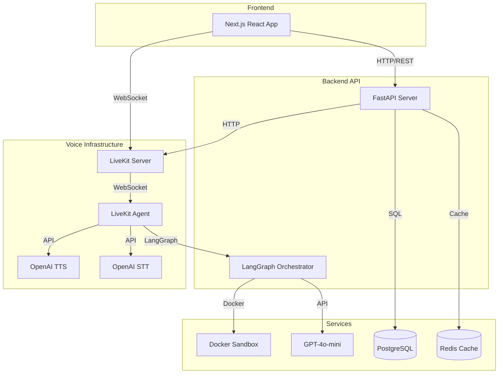
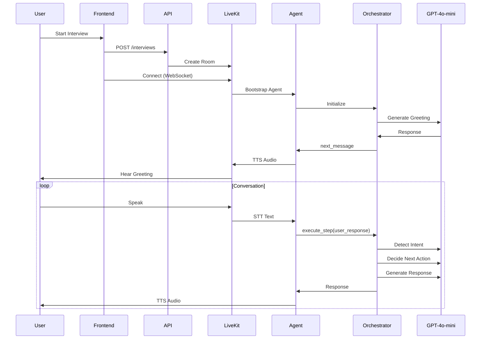

# InterviewLab

**Problem:** Traditional technical interview practice often lacks realism, immediate feedback, and interactive voice-based engagement.

**Solution:** InterviewLab delivers AI-driven technical interviews using real-time voice conversations, live code execution, and in-depth feedback, powered by LangGraph and LiveKit.

## Aim

Provide candidates with realistic interview practice through:

- **Natural voice conversations** with AI interviewer
- **Live code execution** in isolated sandbox
- **Comprehensive feedback** on communication, technical knowledge, problem-solving, and code quality
- **Resume-based questions** tailored to candidate background

## High-Level Architecture



### Core Components

| Component        | Technology     | Purpose                               |
| ---------------- | -------------- | ------------------------------------- |
| **Orchestrator** | LangGraph      | State machine managing interview flow |
| **Agent**        | LiveKit Agents | Real-time voice agent (STT/TTS)       |
| **LLM**          | GPT-4o-mini    | Question generation, decision making  |
| **Sandbox**      | Docker         | Isolated code execution               |
| **Database**     | PostgreSQL     | Interview state, checkpoints          |
| **Cache**        | Redis          | State caching, session management     |

## How It Works

### Interview Flow



### State Management

- **LangGraph MemorySaver**: In-memory state per interview (`thread_id`)
- **Database Checkpoints**: Persistent state after each turn
- **Reducers**: Append-only fields (conversation_history, questions_asked)
- **Single Writer**: Critical fields (next_message, phase) written by one node

## Current Performance

### Strengths

- ✅ **Real-time voice** with <3s latency
- ✅ **State persistence** via checkpoints
- ✅ **Concurrent interviews** (isolated by thread_id)
- ✅ **Code execution** in isolated Docker containers
- ✅ **Comprehensive feedback** with skill breakdowns

## Project Structure

```
InterviewLab/
├── src/                    # Backend (Python/FastAPI)
│   ├── agents/            # LiveKit agent implementation
│   ├── api/               # REST API endpoints
│   │   └── v1/           # API version 1
│   ├── core/              # Core utilities (DB, security, config)
│   ├── models/            # SQLAlchemy database models
│   ├── schemas/           # Pydantic request/response schemas
│   └── services/          # Business logic services
│       ├── analysis/      # Response/code analysis
│       ├── analytics/     # Analytics service
│       ├── data/          # Data management (checkpoints, state)
│       ├── execution/     # Code sandbox execution
│       ├── logging/       # Interview logging
│       ├── orchestrator/  # LangGraph orchestration
│       └── voice/         # LiveKit voice services
├── frontend/              # Frontend (Next.js/React)
│   ├── app/              # Next.js App Router pages
│   ├── components/       # React components
│   ├── lib/              # Utilities (API client, stores)
│   └── hooks/            # Custom React hooks
├── docs/                  # Documentation
├── alembic/              # Database migrations
├── docker-compose.yml    # Local development setup
├── Dockerfile            # Production Docker image
└── pyproject.toml        # Python dependencies
```

**Key Directories:**

| Directory | Purpose |
|-----------|---------|
| `src/agents/` | LiveKit agent entrypoint, resource management |
| `src/services/orchestrator/` | LangGraph state machine, nodes, graph definition |
| `src/services/analysis/` | LLM-based analysis (responses, code, feedback) |
| `src/services/execution/` | Docker-based code sandbox |
| `frontend/components/interview/` | Interview UI components (voice, sandbox) |
| `frontend/lib/api/` | API client and endpoint definitions |

## Documentation

- [Architecture](docs/ARCHITECTURE.md) - System architecture and component relationships
- [API Reference](docs/API.md) - REST API endpoints
- [Frontend](docs/FRONTEND.md) - Next.js frontend architecture and development
- [Voice Infrastructure](docs/VOICE_INFRASTRUCTURE.md) - LiveKit setup and agent architecture
- [User Guide](docs/USER_GUIDE.md) - How to use InterviewLab
- [Local Development](docs/LOCAL_DEVELOPMENT.md) - Setup and development workflow
- [LangGraph Guide](docs/LANGGRAPH.md) - State, nodes, and orchestration
- [NFRs](docs/NFRs.md) - Non-functional requirements and how they're managed
- [Deployment](docs/DEPLOYMENT.md) - Railway and Vercel deployment

## Quick Start

```bash
# Backend
cd src
uvicorn main:app --reload

# Frontend
cd frontend
npm install
npm run dev

# Agent (requires LiveKit server)
python -m src.agents.interview_agent
```

See [Local Development](docs/LOCAL_DEVELOPMENT.md) for detailed setup.

## Tech Stack

| Layer         | Technology                                 |
| ------------- | ------------------------------------------ |
| Frontend      | Next.js 14, React, TypeScript, TailwindCSS |
| Backend       | FastAPI, Python 3.11, SQLAlchemy, Alembic  |
| Voice         | LiveKit, OpenAI TTS/STT, Silero VAD        |
| Orchestration | LangGraph, LangChain                       |
| LLM           | OpenAI GPT-4o-mini, Instructor             |
| Database      | PostgreSQL, Redis                          |
| Execution     | Docker, Python, Node.js                    |
| Deployment    | Railway (backend), Vercel (frontend)       |

## License

Free to use under GNU License
