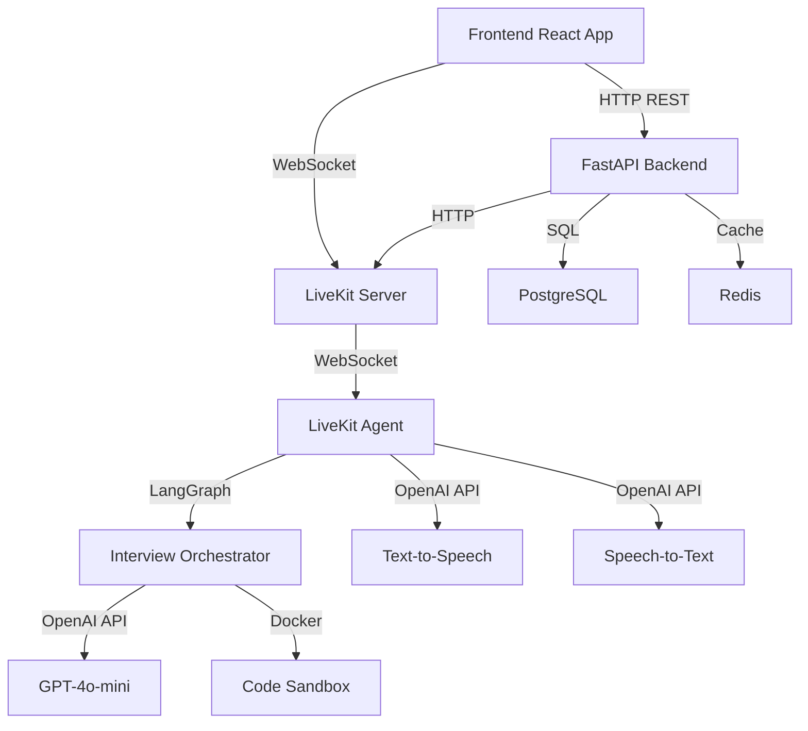
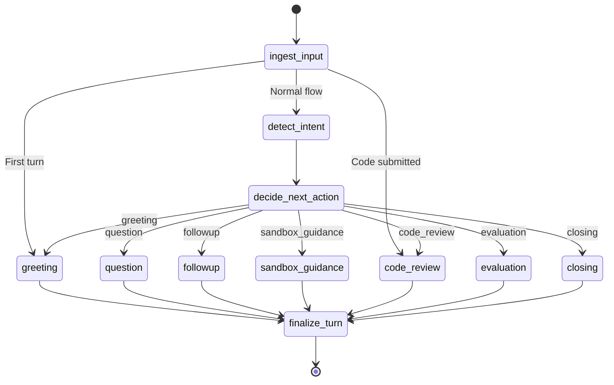
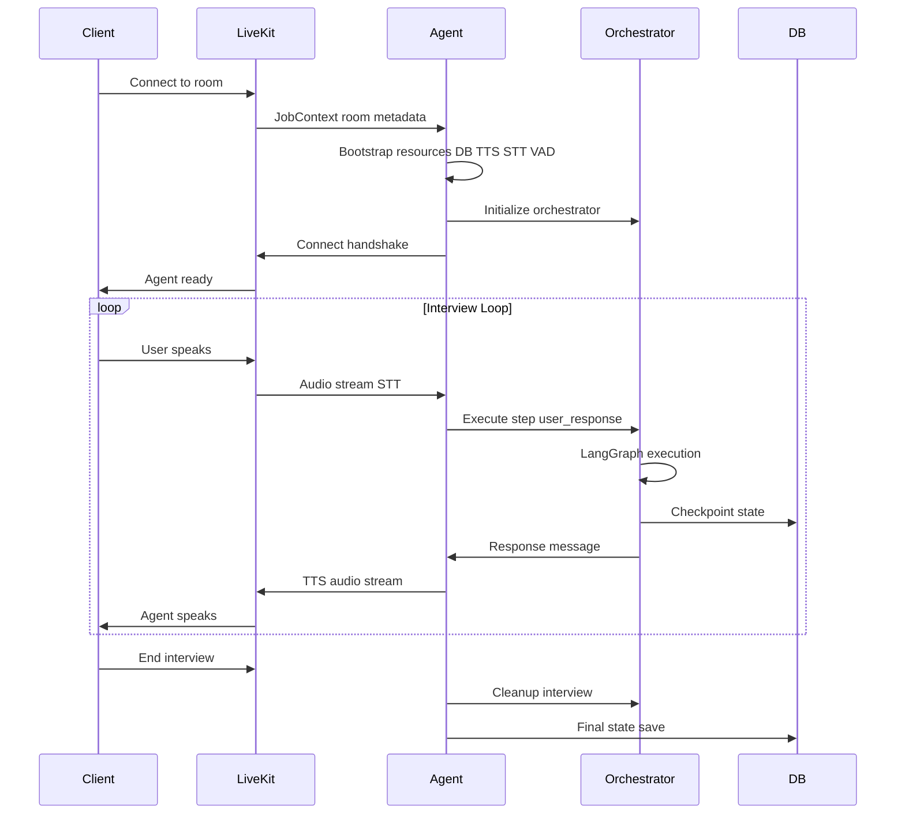
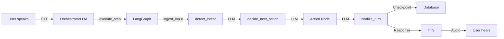
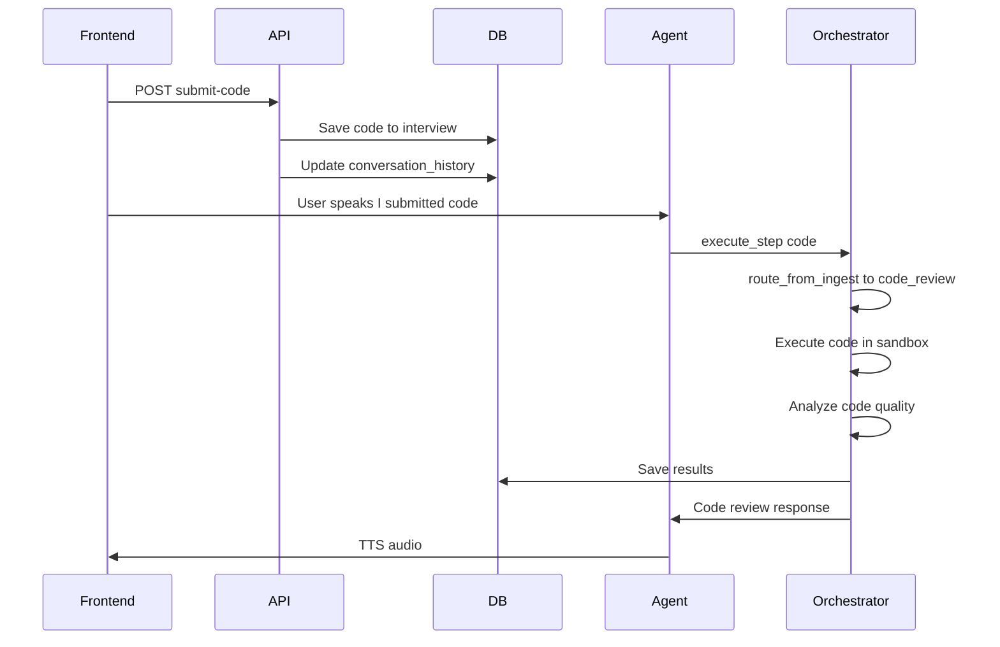

# InterviewLab Architecture

## System Overview

InterviewLab is a voice-based technical interview platform using LangGraph for orchestration and LiveKit for real-time communication.

The system connects a Next.js frontend to a FastAPI backend, which coordinates with LiveKit for real-time voice communication. The LiveKit agent bridges voice streams to the LangGraph orchestrator, which manages interview state and generates responses using GPT-4o-mini.

The frontend establishes two connections: REST for interview management and WebSocket for real-time voice. The agent bootstraps resources before connecting to meet LiveKit's <100ms handshake requirement, then bridges voice streams to the orchestrator via a custom LLM adapter that translates LangGraph state updates into agent responses.

## Core Components

### 1. LangGraph Orchestrator (`src/services/orchestrator/`)

State machine managing interview flow using LangGraph's StateGraph.

**Key Files:**

- `langgraph_orchestrator.py` - Main orchestrator class
- `graph.py` - Graph definition with nodes and edges
- `nodes.py` - NodeHandler combining action/control mixins
- `types.py` - InterviewState TypedDict schema
- `control_nodes.py` - Flow control (initialize, detect_intent, decide_next_action)
- `action_nodes.py` - Response generation (greeting, question, followup, code_review, etc.)

### 2. LiveKit Agent (`src/agents/`)

Real-time voice agent handling STT/TTS and orchestrator integration.

**Key Files:**

- `interview_agent.py` - Agent entrypoint and lifecycle
- `orchestrator_llm.py` - Custom LLM adapter for orchestrator
- `resources.py` - Resource bootstrap and cleanup

### 3. Analysis Services (`src/services/analysis/`)

- `response_analyzer.py` - Analyzes candidate answers
- `code_analyzer.py` - Code quality analysis
- `feedback_generator.py` - Comprehensive feedback generation

### 4. Execution Services (`src/services/execution/`)

- `sandbox_service.py` - Docker-based code execution

## LangGraph Flow

All external inputs funnel through `ingest_input`, which prevents state mutations at graph boundaries. The `route_from_ingest` function checks conversation history to avoid duplicate greetings on reconnects, then routes based on turn count and code presence. `decide_next_action` uses structured LLM output to set `next_node`, which `route_action_node` reads for deterministic routing. Every action node converges on `finalize_turn`, which atomically writes `conversation_history` and checkpoints state.

## Agent Lifecycle

The agent follows a two-phase bootstrap: extract interview_id from room name, then bootstrap all resources before `ctx.connect()`. This ensures the agent is ready before the handshake completes, preventing the frontend from showing an uninitialized participant. Heavy imports (database, orchestrator, TTS/STT) are deferred until after metadata extraction. VAD is required for OpenAI's non-streaming STT to detect speech boundaries. The agent monitors interview status every 5 seconds and triggers cleanup when status becomes "completed".

## State Management

**InterviewState** (TypedDict) contains:

- **Append-only fields** (reducers): `conversation_history`, `questions_asked`, `detected_intents`, `code_submissions`
- **Single-writer fields**: `next_message`, `phase`, `last_node`
- **Sandbox state**: Code execution tracking
- **Topics covered**: Simple list (no complex tracking)

**Checkpointing:**

- LangGraph MemorySaver: In-memory per `thread_id`
- Database: Persistent checkpoints via `CheckpointService`
- Redis: Optional caching layer

## Key Design Decisions

1. **LangGraph StateGraph**: Explicit edges, no mutations, reducers for append-only fields
2. **LLM-only decisions**: Removed heuristics, trust LLM for flow control
3. **Simplified resume tracking**: Topics list instead of complex anchor/aspect system
4. **Single entry point**: `ingest_input_node` for all external data
5. **Resource cleanup**: Explicit cleanup to prevent memory leaks

## Data Flow: User Response

The `OrchestratorLLM` adapter wraps the orchestrator, translating agent callbacks into `execute_step` invocations. It loads state from the database checkpoint, passes user input through the graph, then extracts `next_message` from the updated state. The adapter handles thread*id isolation (`interview*{interview_id}`) so concurrent interviews don't leak state. Each graph execution is atomic: state updates, checkpoint writes, and response generation happen in a single transaction.

## Code Submission Flow

Code submissions are saved to the database first, then the user's voice message triggers the orchestrator with `current_code` set. The `route_from_ingest` function detects `current_code` and bypasses intent detection, routing directly to `code_review`. The sandbox service executes code in isolated Docker containers, and `get_code_metrics` analyzes quality using AST parsing and complexity metrics. Results are appended to `code_submissions` via reducer, ensuring atomic updates even with concurrent state modifications.
