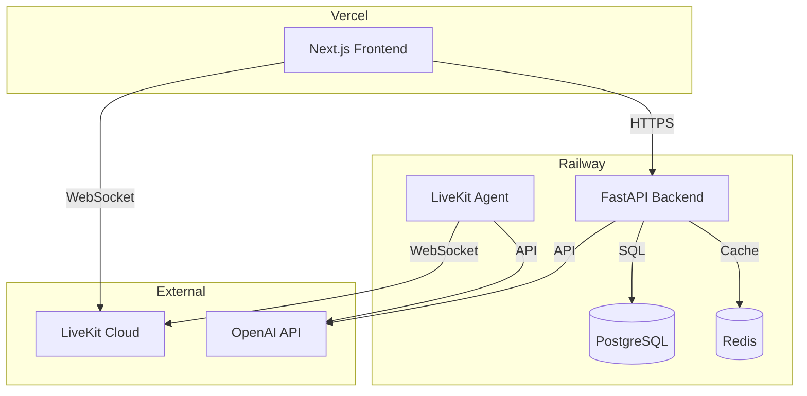

# Deployment Guide

## Overview

InterviewLab deploys to:

- **Railway**: Backend API, Agent, Database, Redis
- **Vercel**: Frontend (Next.js)



## Railway Deployment (Backend)

### Prerequisites

- Railway account: [railway.app](https://railway.app)
- GitHub repository connected
- Railway CLI installed: `npm i -g @railway/cli`

### 1. Create Project

```bash
railway login
railway init
```

### 2. Add Services

**PostgreSQL:**

```bash
railway add postgresql
# Note DATABASE_URL from service variables
```

**Redis:**

```bash
railway add redis
# Note REDIS_URL from service variables
```

### 3. Configure Environment Variables

In Railway dashboard → Variables:

| Variable             | Value                              | Source  |
| -------------------- | ---------------------------------- | ------- |
| `DATABASE_URL`       | Auto-set by PostgreSQL service     | Railway |
| `REDIS_URL`          | Auto-set by Redis service          | Railway |
| `SECRET_KEY`         | Generate: `openssl rand -hex 32`   | Manual  |
| `OPENAI_API_KEY`     | Your OpenAI API key                | Manual  |
| `LIVEKIT_URL`        | `wss://your-project.livekit.cloud` | LiveKit |
| `LIVEKIT_API_KEY`    | LiveKit API key                    | LiveKit |
| `LIVEKIT_API_SECRET` | LiveKit API secret                 | LiveKit |
| `ENVIRONMENT`        | `production`                       | Manual  |
| `LOG_LEVEL`          | `INFO`                             | Manual  |

### 4. Deploy Backend API

**Create `railway.json`:**

```json
{
  "$schema": "https://railway.app/railway.schema.json",
  "build": {
    "builder": "DOCKERFILE",
    "dockerfilePath": "Dockerfile"
  },
  "deploy": {
    "startCommand": "uvicorn src.main:app --host 0.0.0.0 --port $PORT",
    "restartPolicyType": "ON_FAILURE",
    "restartPolicyMaxRetries": 10
  }
}
```

**Deploy:**

```bash
railway up
```

**Set Public Domain:**

- Railway dashboard → Settings → Generate Domain
- Note domain: `your-app.railway.app`

### 5. Deploy Agent

**Create separate service for agent:**

```bash
railway service create interview-agent
railway link interview-agent
```

**Create `railway-agent.json`:**

```json
{
  "$schema": "https://railway.app/railway.schema.json",
  "build": {
    "builder": "DOCKERFILE",
    "dockerfilePath": "Dockerfile"
  },
  "deploy": {
    "startCommand": "python -m livekit.agents start src.agents.interview_agent",
    "restartPolicyType": "ON_FAILURE",
    "restartPolicyMaxRetries": 10
  }
}
```

**Environment Variables (same as API):**

- Copy all variables from API service
- Add: `LIVEKIT_AGENT_URL` (if using agent URL)

**Deploy:**

```bash
railway up
```

### 6. Database Migrations

**Run migrations on deploy:**

```bash
railway run alembic upgrade head
```

Or add to startup script:

```bash
# In Dockerfile or startup script
alembic upgrade head && uvicorn src.main:app --host 0.0.0.0 --port $PORT
```

### 7. Health Checks

Railway automatically checks `/health` endpoint:

```python
# src/main.py
@app.get("/health")
async def health_check():
    return {"status": "healthy"}
```

## Vercel Deployment (Frontend)

### Prerequisites

- Vercel account: [vercel.com](https://vercel.com)
- Vercel CLI: `npm i -g vercel`

### 1. Connect Repository

1. Go to Vercel dashboard
2. Import Git repository
3. Select `frontend/` as root directory

### 2. Configure Environment Variables

In Vercel dashboard → Settings → Environment Variables:

| Variable                  | Value                              | Environment |
| ------------------------- | ---------------------------------- | ----------- |
| `NEXT_PUBLIC_API_URL`     | `https://your-app.railway.app`     | Production  |
| `NEXT_PUBLIC_LIVEKIT_URL` | `wss://your-project.livekit.cloud` | Production  |

### 3. Build Settings

**Framework Preset:** Next.js
**Root Directory:** `frontend`
**Build Command:** `npm run build`
**Output Directory:** `.next`

### 4. Deploy

```bash
cd frontend
vercel --prod
```

Or push to main branch (auto-deploy enabled).

## LiveKit Setup

### Option 1: LiveKit Cloud (Recommended)

1. Sign up: [livekit.io](https://livekit.io)
2. Create project
3. Get credentials:
   - URL: `wss://your-project.livekit.cloud`
   - API Key
   - API Secret

### Option 2: Self-Hosted

**Deploy on Railway:**

```bash
railway service create livekit-server
railway add livekit-server
```

**Environment Variables:**

```bash
LIVEKIT_KEYS="api-key: api-secret"
```

**Deploy LiveKit:**

```dockerfile
FROM livekit/livekit-server
# Configure in railway
```

## Docker Configuration

### Dockerfile

```dockerfile
FROM python:3.11-slim

WORKDIR /app

# Install dependencies
COPY pyproject.toml ./
RUN pip install --no-cache-dir -r requirements.txt

# Copy source
COPY src/ ./src/
COPY alembic.ini ./
COPY alembic/ ./alembic/

# Run migrations and start
CMD alembic upgrade head && uvicorn src.main:app --host 0.0.0.0 --port $PORT
```

### Docker Compose (Local Testing)

```yaml
version: "3.8"
services:
  api:
    build: .
    ports:
      - "8000:8000"
    environment:
      - DATABASE_URL=postgresql://...
    depends_on:
      - db
      - redis

  db:
    image: postgres:14
    environment:
      - POSTGRES_DB=interviewlab

  redis:
    image: redis:7
```

## Monitoring

### Railway Metrics

- **CPU Usage:** Monitor in Railway dashboard
- **Memory Usage:** Check service metrics
- **Logs:** View in Railway dashboard → Logs

### Application Logs

**Backend:**

```bash
railway logs
railway logs --service interview-agent
```

**Frontend:**

- Vercel dashboard → Logs

### Health Checks

**API Health:**

```bash
curl https://your-app.railway.app/health
```

**Agent Health:**

- Check LiveKit dashboard for agent connections
- Verify agent logs show successful connections

## Scaling

### Backend API

**Horizontal Scaling:**

- Railway auto-scales based on traffic
- Multiple instances share database/Redis

**Resource Limits:**

- CPU: 2 vCPU (recommended)
- Memory: 2GB (recommended)
- Disk: 10GB (for logs)

### Agent

**Scaling Agents:**

- Deploy multiple agent instances
- LiveKit distributes connections
- Each agent handles 50+ concurrent interviews

**Resource Limits:**

- CPU: 1 vCPU per agent
- Memory: 1GB per agent
- Consider: Agent count = Expected interviews / 50

### Database

**PostgreSQL Scaling:**

- Start: Railway shared PostgreSQL
- Scale: Dedicated PostgreSQL (higher tier)
- Connection pooling: Use PgBouncer

### Redis

**Redis Scaling:**

- Start: Railway Redis (256MB)
- Scale: Upgrade to higher tier
- Use: Caching, session storage

## Troubleshooting

| Issue                         | Solution                                      |
| ----------------------------- | --------------------------------------------- |
| **Build fails**               | Check Dockerfile, verify dependencies         |
| **Database connection error** | Verify DATABASE_URL, check PostgreSQL service |
| **Agent won't connect**       | Verify LiveKit credentials, check agent logs  |
| **Frontend can't reach API**  | Check CORS settings, verify API URL           |
| **High memory usage**         | Enable cleanup, check for memory leaks        |
| **Slow responses**            | Check database queries, enable Redis caching  |

## CI/CD

### GitHub Actions (Optional)

```yaml
name: Deploy
on:
  push:
    branches: [main]

jobs:
  deploy-backend:
    runs-on: ubuntu-latest
    steps:
      - uses: actions/checkout@v3
      - uses: railway-app/railway-action@v1
        with:
          service: api
          token: ${{ secrets.RAILWAY_TOKEN }}

  deploy-frontend:
    runs-on: ubuntu-latest
    steps:
      - uses: actions/checkout@v3
      - uses: amondnet/vercel-action@v20
        with:
          vercel-token: ${{ secrets.VERCEL_TOKEN }}
          vercel-org-id: ${{ secrets.VERCEL_ORG_ID }}
          vercel-project-id: ${{ secrets.VERCEL_PROJECT_ID }}
          working-directory: ./frontend
```

## Security

### Environment Variables

- **Never commit** `.env` files
- Use Railway/Vercel secrets
- Rotate keys regularly

### API Security

- **CORS:** Configure allowed origins
- **Rate Limiting:** Implement per endpoint
- **Authentication:** JWT tokens required

### Database Security

- **SSL:** Enable PostgreSQL SSL
- **Backups:** Enable automatic backups
- **Access:** Restrict database access

## Cost Estimation

| Service                  | Tier          | Monthly Cost |
| ------------------------ | ------------- | ------------ |
| **Railway (API)**        | Hobby         | $5-20        |
| **Railway (Agent)**      | Hobby         | $5-20        |
| **Railway (PostgreSQL)** | Hobby         | $5-10        |
| **Railway (Redis)**      | Hobby         | $5-10        |
| **Vercel (Frontend)**    | Hobby         | Free         |
| **LiveKit Cloud**        | Starter       | $0-50        |
| **OpenAI API**           | Pay-as-you-go | $10-100+     |
| **Total**                |               | $30-220+     |

## Next Steps

- [Local Development](LOCAL_DEVELOPMENT.md)
- [API Reference](API.md)
- [Architecture](ARCHITECTURE.md)
