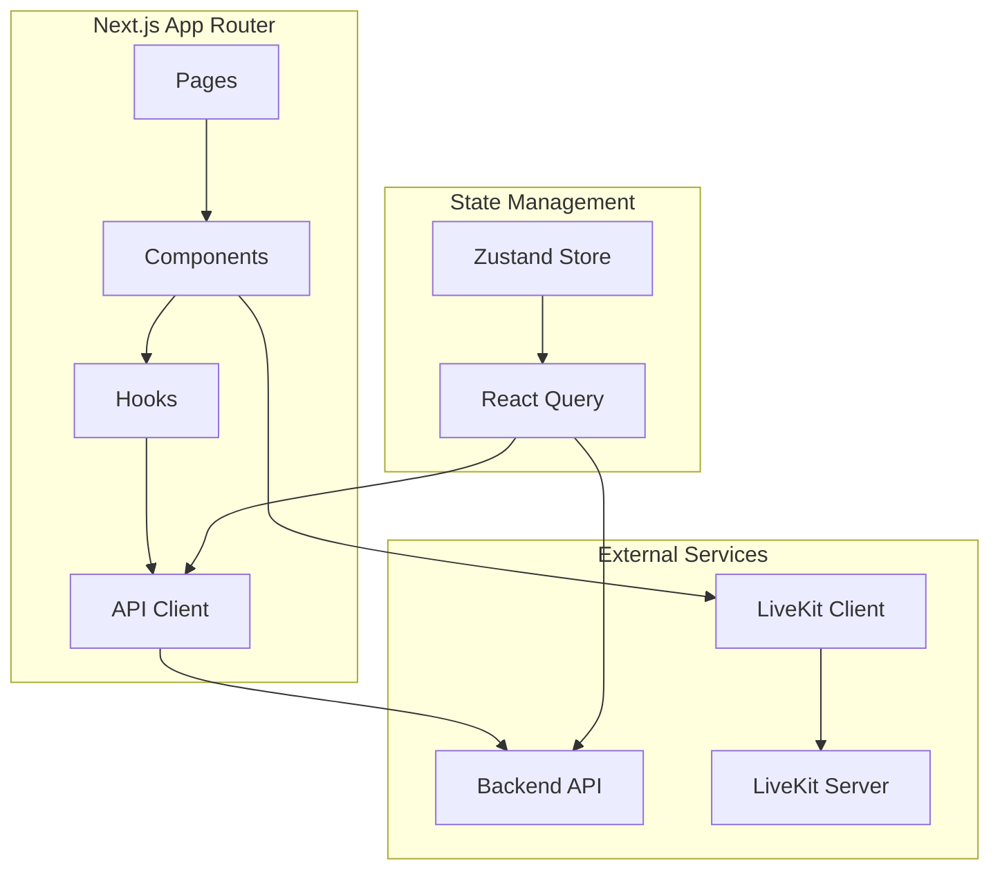
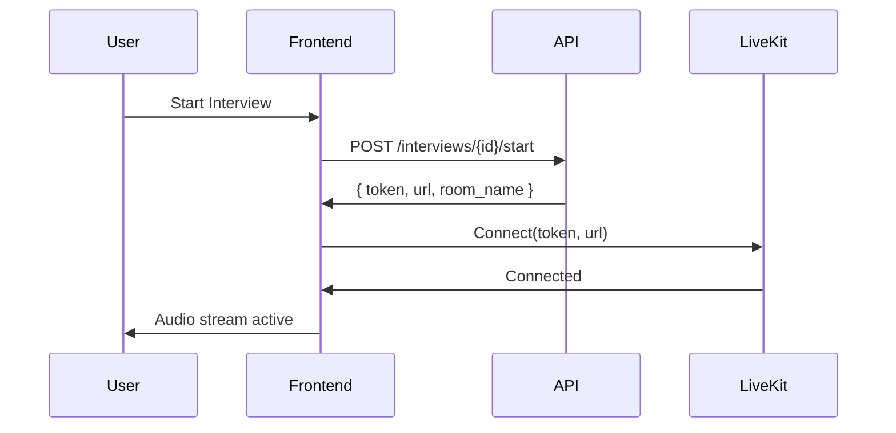

# Frontend Documentation

## Overview

InterviewLab frontend is a modern Next.js 14 application built with TypeScript, React, and Tailwind CSS. It provides a responsive, accessible interface for conducting voice-based technical interviews.

## Architecture



## Tech Stack

| Technology         | Version         | Purpose                       |
| ------------------ | --------------- | ----------------------------- |
| **Next.js**        | 14 (App Router) | React framework, routing, SSR |
| **React**          | 19.2            | UI library                    |
| **TypeScript**     | 5+              | Type safety                   |
| **Tailwind CSS**   | 4               | Styling                       |
| **shadcn/ui**      | Latest          | Component library             |
| **Zustand**        | 5.0             | State management              |
| **TanStack Query** | 5.90            | Data fetching, caching        |
| **LiveKit Client** | 2.16            | Real-time voice communication |
| **Monaco Editor**  | 4.7             | Code editor                   |
| **Axios**          | 1.13            | HTTP client                   |

## Project Structure

```
frontend/
├── app/                      # Next.js App Router
│   ├── (auth)/              # Auth routes (login, register)
│   ├── dashboard/           # Protected dashboard routes
│   │   ├── interviews/      # Interview management
│   │   ├── resumes/         # Resume management
│   │   ├── analytics/       # Analytics dashboard
│   │   └── sandbox/         # Standalone sandbox
│   ├── layout.tsx           # Root layout
│   └── providers.tsx        # React Query provider
├── components/              # React components
│   ├── interview/           # Interview-specific components
│   ├── analytics/           # Analytics charts
│   ├── layout/              # Layout components
│   └── ui/                  # shadcn/ui components
├── lib/                     # Utilities
│   ├── api/                 # API client & endpoints
│   └── store/               # Zustand stores
├── hooks/                   # Custom React hooks
└── public/                  # Static assets
```

## Key Components

### Interview Components

| Component                     | Purpose                  | Key Features                            |
| ----------------------------- | ------------------------ | --------------------------------------- |
| **voice-video.tsx**           | Main interview interface | LiveKit connection, audio visualization |
| **sandbox.tsx**               | Code editor & execution  | Monaco editor, code submission, results |
| **transcription-display.tsx** | Conversation transcript  | Real-time transcription display         |
| **room-controls.tsx**         | Interview controls       | Mute, disconnect, settings              |

### API Integration

**API Client** (`lib/api/client.ts`):

- Axios-based HTTP client
- Automatic token injection
- Error handling & 401 redirect
- Request/response interceptors

**API Endpoints** (`lib/api/`):

- `auth.ts` - Authentication
- `interviews.ts` - Interview CRUD, code submission
- `resumes.ts` - Resume upload, analysis
- `voice.ts` - LiveKit token generation

**Example Usage:**

```typescript
import { interviewsApi } from "@/lib/api/interviews";

// Create interview
const interview = await interviewsApi.create({
  title: "Python Engineer Interview",
  resume_id: 123,
});

// Submit code
await interviewsApi.submitCode(interviewId, code, "python");
```

## LiveKit Integration

### Connection Flow



### useLiveKitRoom Hook

**Location:** `hooks/use-livekit-room.ts`

**Features:**

- Automatic connection management
- Audio track subscription
- Connection state tracking
- Error handling & reconnection

**Usage:**

```typescript
const { room, state, isConnected, connect, disconnect } = useLiveKitRoom({
  token: livekitToken,
  url: livekitUrl,
  onConnected: (room) => console.log("Connected"),
  onDisconnected: () => console.log("Disconnected"),
});
```

**Connection States:**

- `idle` - Not connected
- `connecting` - Connection in progress
- `connected` - Active connection
- `disconnected` - Connection lost
- `error` - Connection error

## State Management

### Zustand Store

**Auth Store** (`lib/store/auth-store.ts`):

```typescript
interface AuthStore {
  user: User | null;
  token: string | null;
  login: (email: string, password: string) => Promise<void>;
  logout: () => void;
  isAuthenticated: boolean;
}
```

### React Query

**Data Fetching:**

- Automatic caching
- Background refetching
- Optimistic updates
- Error handling

**Example:**

```typescript
const { data, isLoading, error } = useQuery({
  queryKey: ["interview", id],
  queryFn: () => interviewsApi.get(id),
  refetchInterval: 2000, // Poll every 2s for active interviews
});
```

## Code Sandbox

### Features

| Feature        | Implementation                      |
| -------------- | ----------------------------------- |
| **Editor**     | Monaco Editor (VS Code editor)      |
| **Languages**  | Python, JavaScript                  |
| **Execution**  | Real-time code execution via API    |
| **Results**    | stdout, stderr, exit code display   |
| **Submission** | Submit code to interview for review |

### Sandbox Component

**Location:** `components/interview/sandbox.tsx`

**Key Functionality:**

1. **Code Editing**: Monaco editor with syntax highlighting
2. **Language Selection**: Python/JavaScript toggle
3. **Local Execution**: Test code before submission
4. **Code Submission**: Submit to interview orchestrator
5. **Polling**: Check for agent guidance/feedback

**Code Submission Flow:**

```mermaid
graph LR
    A[User writes code] --> B[Click Submit]
    B --> C[POST /interviews/{id}/submit-code]
    C --> D[Code saved to interview]
    D --> E[Agent processes code]
    E --> F[Code review response]
```

## Routing & Navigation

### Route Structure

| Route                        | Purpose             | Auth Required |
| ---------------------------- | ------------------- | ------------- |
| `/`                          | Landing page        | No            |
| `/login`                     | User login          | No            |
| `/register`                  | User registration   | No            |
| `/dashboard`                 | Main dashboard      | Yes           |
| `/dashboard/interviews`      | Interview list      | Yes           |
| `/dashboard/interviews/[id]` | Interview page      | Yes           |
| `/dashboard/resumes`         | Resume list         | Yes           |
| `/dashboard/analytics`       | Analytics dashboard | Yes           |

### Protected Routes

**Implementation:** `components/auth/protected-route.tsx`

```typescript
<ProtectedRoute>
  <DashboardLayout>{/* Protected content */}</DashboardLayout>
</ProtectedRoute>
```

## Styling

### Design System

**Colors:**

- Primary: Professional blue (`hsl(221, 83%, 53%)`)
- Secondary: Subtle gray
- Destructive: Red for errors
- Muted: Light backgrounds

**Components:**

- shadcn/ui components (Radix UI primitives)
- Tailwind CSS utilities
- Dark mode support via `next-themes`

### Responsive Design

| Breakpoint    | Usage            |
| ------------- | ---------------- |
| `sm` (640px)  | Mobile landscape |
| `md` (768px)  | Tablet           |
| `lg` (1024px) | Desktop          |
| `xl` (1280px) | Large desktop    |

## Performance Optimizations

### Code Splitting

- **Dynamic Imports**: Monaco editor loaded dynamically
- **Route-based splitting**: Next.js automatic code splitting
- **Component lazy loading**: Heavy components loaded on demand

### Caching

- **React Query**: API response caching
- **Next.js**: Static asset caching
- **Browser**: Service worker (if implemented)

### Bundle Optimization

- **Tree shaking**: Unused code eliminated
- **Minification**: Production builds minified
- **Compression**: Gzip/Brotli enabled

## Development

### Setup

```bash
cd frontend
npm install
cp .env.local.example .env.local
# Edit .env.local with API URL
npm run dev
```

### Environment Variables

```bash
NEXT_PUBLIC_API_URL=http://localhost:8000
NEXT_PUBLIC_LIVEKIT_URL=ws://localhost:7880
```

### Scripts

| Script          | Purpose                  |
| --------------- | ------------------------ |
| `npm run dev`   | Start development server |
| `npm run build` | Build for production     |
| `npm run start` | Start production server  |
| `npm run lint`  | Run ESLint               |

### Type Checking

```bash
# TypeScript check
npx tsc --noEmit

# Or via IDE (VS Code with TypeScript extension)
```

## Component Patterns

### API Integration Pattern

```typescript
// 1. Define API function
export const interviewsApi = {
  get: async (id: number): Promise<Interview> => {
    return apiClient.get(`/api/v1/interviews/${id}`);
  },
};

// 2. Use in component with React Query
const { data, isLoading } = useQuery({
  queryKey: ["interview", id],
  queryFn: () => interviewsApi.get(id),
});
```

### LiveKit Pattern

```typescript
// 1. Get token from API
const { data: tokenData } = useQuery({
  queryKey: ["livekit-token", interviewId],
  queryFn: () => voiceApi.getToken({ room_name: `interview-${interviewId}` }),
});

// 2. Connect with hook
const { room, isConnected } = useLiveKitRoom({
  token: tokenData?.token,
  url: tokenData?.url,
});
```

## Error Handling

### API Errors

**Automatic Handling:**

- 401 → Redirect to login
- Network errors → User-friendly messages
- Validation errors → Display in forms

**Manual Handling:**

```typescript
try {
  await interviewsApi.create(data);
} catch (error) {
  if (error instanceof ApiError) {
    toast.error(error.message);
  }
}
```

### LiveKit Errors

**Connection Errors:**

- Automatic reconnection attempts
- User notification on failure
- Graceful degradation

````

## Deployment

### Vercel (Recommended)

1. Connect GitHub repository
2. Set environment variables
3. Deploy automatically on push

**Build Settings:**
- Framework: Next.js
- Root Directory: `frontend`
- Build Command: `npm run build`
- Output Directory: `.next`

### Environment Variables (Production)

```bash
NEXT_PUBLIC_API_URL=
NEXT_PUBLIC_LIVEKIT_URL=wss://your-project.livekit.cloud
````

## Troubleshooting

| Issue                       | Solution                                      |
| --------------------------- | --------------------------------------------- |
| **Build fails**             | Check TypeScript errors, verify dependencies  |
| **API calls fail**          | Verify `NEXT_PUBLIC_API_URL` is set correctly |
| **LiveKit won't connect**   | Check token generation, verify WebSocket URL  |
| **Code editor not loading** | Ensure Monaco Editor is dynamically imported  |
| **Styling issues**          | Verify Tailwind config, check class names     |

## Best Practices

1. **Type Safety**: Always use TypeScript types
2. **Error Boundaries**: Wrap components in error boundaries
3. **Loading States**: Show loading indicators for async operations
4. **Optimistic Updates**: Update UI before API confirmation
5. **Accessibility**: Use semantic HTML, ARIA labels
6. **Performance**: Lazy load heavy components
7. **Security**: Never expose API keys in client code

## Next Steps

- [API Reference](../docs/API.md)
- [Local Development](../docs/LOCAL_DEVELOPMENT.md)
- [Deployment](../docs/DEPLOYMENT.md)

