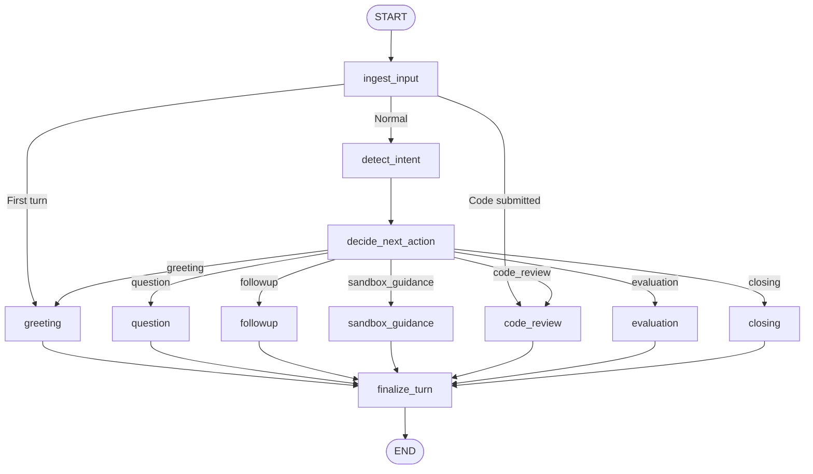
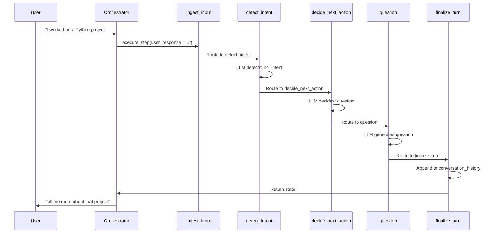

# LangGraph Orchestration Guide

## Overview

InterviewLab uses **LangGraph** to manage interview state and flow. LangGraph provides:

- **Explicit state machine** with nodes and edges
- **Reducers** for append-only fields (prevents race conditions)
- **Checkpointing** for state persistence
- **Concurrent safety** via thread isolation

## State Schema

### InterviewState (TypedDict)

```python
class InterviewState(TypedDict):
    # Core identifiers
    interview_id: int
    user_id: int
    resume_id: int | None

    # Append-only (reducers)
    conversation_history: Annotated[list[dict], operator.add]
    questions_asked: Annotated[list[QuestionRecord], operator.add]
    detected_intents: Annotated[list[UserIntent], operator.add]
    code_submissions: Annotated[list[dict], operator.add]

    # Single-writer fields
    next_message: str | None
    phase: str  # intro | exploration | technical | closing
    last_node: str
    next_node: str | None

    # Runtime
    turn_count: int
    answer_quality: float
    topics_covered: list[str]
    sandbox: SandboxState
```

### Field Types

| Type              | Fields                                                                            | Behavior                     |
| ----------------- | --------------------------------------------------------------------------------- | ---------------------------- |
| **Reducer**       | `conversation_history`, `questions_asked`, `detected_intents`, `code_submissions` | Append-only, atomic merge    |
| **Single Writer** | `next_message`, `phase`, `last_node`                                              | One node writes, others read |
| **Mutable**       | `topics_covered`, `sandbox`                                                       | Manual merge in nodes        |

## Graph Structure



## Node Types

### Control Nodes

| Node                   | Purpose                       | Input                           | Output                                         |
| ---------------------- | ----------------------------- | ------------------------------- | ---------------------------------------------- |
| **initialize**         | Set default values            | Partial state                   | Defaults for missing fields                    |
| **ingest_input**       | Entry point for external data | `last_response`, `current_code` | Incremented `turn_count`                       |
| **detect_intent**      | Analyze user intent           | `last_response`                 | `detected_intents`, `active_user_request`      |
| **decide_next_action** | Choose next node              | Full state                      | `next_node`                                    |
| **finalize_turn**      | Write to conversation_history | Full state                      | `conversation_history`, `conversation_summary` |

### Action Nodes

| Node                 | Purpose               | Trigger                                 | Output                              |
| -------------------- | --------------------- | --------------------------------------- | ----------------------------------- |
| **greeting**         | Initial welcome       | First turn                              | Personalized greeting               |
| **question**         | Resume-based question | `decide_next_action` → question         | Question text, `topics_covered`     |
| **followup**         | Deep dive question    | `decide_next_action` → followup         | Follow-up question                  |
| **sandbox_guidance** | Guide to code sandbox | `decide_next_action` → sandbox_guidance | Exercise, hints                     |
| **code_review**      | Review submitted code | Code in state                           | Execution results, quality analysis |
| **evaluation**       | Generate feedback     | `decide_next_action` → evaluation       | Comprehensive feedback              |
| **closing**          | End interview         | `decide_next_action` → closing          | Closing message                     |

## State Flow Example



## Decision Making

### decide_next_action_node

**Input:** Full state (conversation, questions, intents, sandbox)

**Process:**

1. Build decision context (conversation, state, metrics)
2. LLM call with structured output (`NextActionDecision`)
3. Return `next_node` in state

**LLM Prompt Structure:**

```
CONVERSATION: [last 10 messages]
STATE: Turn, Phase, Questions count, Sandbox status
AVAILABLE ACTIONS: greeting, question, followup, ...
DECISION PRINCIPLES: Natural flow, variety, user requests
```

**Output:** `{"next_node": "question", "last_node": "decide_next_action"}`

### Routing

```python
def route_action_node(state: InterviewState) -> str:
    """Route based on next_node from decide_next_action."""
    action = state.get("next_node")
    # Validates and returns action or defaults to "question"
    return action
```

## Checkpointing

### MemorySaver (In-Memory)

- **Scope:** Per `thread_id` (interview_id)
- **Lifetime:** Until orchestrator cleanup
- **Purpose:** Fast state access during graph execution

```python
thread_id = f"interview_{interview_id}"
config = {"configurable": {"thread_id": thread_id}}
state = await graph.ainvoke(state, config)
```

### Database Checkpoints

- **When:** After `finalize_turn` completes
- **Service:** `CheckpointService`
- **Purpose:** Persistent state for recovery

```python
if final_state.get("last_node") == "finalize_turn":
    await checkpoint_service.checkpoint(final_state, db_session)
```

### State Restoration

```python
# Load from checkpoint or reconstruct from interview
checkpoint_state = await checkpoint_service.restore(interview_id, db)
if checkpoint_state:
    state = checkpoint_state
else:
    state = interview_to_state(interview, user)
```

## Adding a New Node

### 1. Define Node Method

```python
# src/services/orchestrator/action_nodes.py
class ActionNodeMixin:
    async def my_new_node(self, state: InterviewState) -> InterviewState:
        """My new node description."""
        # Build context
        context = build_conversation_context(state)

        # LLM call
        response = await self.llm_helper.call_llm_creative(
            system_prompt="...",
            user_prompt=context
        )

        # Return state updates (no mutations)
        return {
            "last_node": "my_new_node",
            "next_message": response,
            "phase": state.get("phase")
        }
```

### 2. Add to Graph

```python
# src/services/orchestrator/graph.py
graph.add_node("my_new_node", node_handler.my_new_node)

# Add edge
graph.add_edge("my_new_node", "finalize_turn")

# Add routing (if conditional)
graph.add_conditional_edges(
    "decide_next_action",
    route_action_node,
    {
        "my_new_node": "my_new_node",
        # ... other actions
    }
)
```

### 3. Update Types

```python
# src/services/orchestrator/types.py
class NextActionDecision(BaseModel):
    action: Literal[
        "greeting", "question", "followup",
        "my_new_node",  # Add here
        # ...
    ]
```

## State Validation

### Interview ID Validation

**Entry Point:**

```python
# langgraph_orchestrator.py
interview_id = state.get("interview_id")
if not interview_id:
    raise ValueError("State missing interview_id")
```

**Exit Point:**

```python
final_interview_id = final_state.get("interview_id")
if final_interview_id != interview_id:
    raise ValueError("State interview_id changed")
```

### State Corruption Prevention

- **No mutations:** All nodes return new state dicts
- **Reducer safety:** Append-only fields use `operator.add`
- **Single writer:** Critical fields written by one node only
- **Validation:** Check interview_id at boundaries

## Debugging

### State Inspection

```python
# In node
logger.debug(f"State keys: {sorted(state.keys())}")
logger.debug(f"Turn: {state.get('turn_count')}, Phase: {state.get('phase')}")
```

### Graph Execution Logs

```python
# Enable debug logging
LOG_LEVEL = "DEBUG"

# View node execution
# Logs show: node_name → state_updates
```

### Common Issues

| Issue                  | Cause                 | Solution                        |
| ---------------------- | --------------------- | ------------------------------- |
| **State pollution**    | interview_id changed  | Validate at entry/exit          |
| **Duplicate messages** | Reducer not working   | Check `operator.add` annotation |
| **Stuck in loop**      | Routing error         | Check `next_node` value         |
| **Missing fields**     | Initialize not called | Ensure initialize runs first    |

## Best Practices

1. **No Mutations:** Always return new dict, never modify state
2. **Idempotent Nodes:** Safe to call multiple times
3. **Clear Boundaries:** One responsibility per node
4. **Error Handling:** Return partial state on errors
5. **Logging:** Log state transitions for debugging

## Performance

| Operation             | Latency   | Notes                      |
| --------------------- | --------- | -------------------------- |
| **Node execution**    | 100-500ms | LLM calls dominate         |
| **Graph execution**   | 1-3s      | Multiple nodes in sequence |
| **Checkpointing**     | 50-200ms  | Database write             |
| **State restoration** | 100-300ms | Load from DB/checkpoint    |
