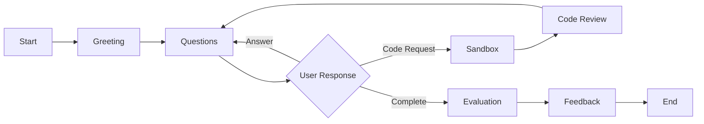

# User Guide

## Getting Started

### 1. Create Account

1. Navigate to `/register`
2. Enter email and password
3. Verify email (if required)
4. Log in at `/login`

### 2. Upload Resume

1. Go to **Resumes** → **Upload Resume**
2. Upload PDF resume
3. Wait for analysis (30-60 seconds)
4. Review extracted data

**Supported Formats:** PDF only

### 3. Start Interview

1. Go to **Interviews** → **New Interview**
2. Select analyzed resume
3. (Optional) Add job description
4. Click **Start Interview**

## Interview Flow

### Phases

| Phase           | Description                     | Duration  |
| --------------- | ------------------------------- | --------- |
| **Intro**       | Greeting, initial questions     | 2-5 min   |
| **Exploration** | Resume-based questions          | 10-20 min |
| **Technical**   | Code exercises, problem-solving | 10-15 min |
| **Closing**     | Final questions, wrap-up        | 2-5 min   |

## Using the Code Sandbox

### Accessing Sandbox

1. During interview, agent may guide you to sandbox
2. Sandbox appears on right side of screen
3. Select language (Python/JavaScript)

### Writing Code

1. Type code in editor
2. Click **Run** to test locally
3. Click **Submit** to submit to interview
4. Agent reviews code and provides feedback

### Supported Languages

| Language       | Version | Features                                    |
| -------------- | ------- | ------------------------------------------- |
| **Python**     | 3.11    | Full standard library, no external packages |
| **JavaScript** | Node 18 | Standard Node.js APIs                       |

### Code Submission

**What happens:**

1. Code executed in isolated Docker container
2. Execution results analyzed
3. Code quality assessed (correctness, efficiency, readability)
4. Agent provides feedback

**Best Practices:**

- Write clear, readable code
- Add comments for complex logic
- Test your code before submitting
- Follow language best practices

## Interview Tips

### Communication

- **Speak clearly**: Enunciate words, avoid mumbling
- **Be concise**: Answer directly, avoid rambling
- **Ask for clarification**: If question unclear, ask agent to rephrase

### Technical Questions

- **Think aloud**: Explain your thought process
- **Start simple**: Begin with basic solution, then optimize
- **Admit uncertainty**: It's okay to say "I'm not sure, but I think..."

### Code Exercises

- **Read carefully**: Understand problem before coding
- **Test edge cases**: Consider boundary conditions
- **Refactor if needed**: Improve code after initial solution

## Understanding Feedback

### Skill Breakdown

| Skill                   | Weight | Description                          |
| ----------------------- | ------ | ------------------------------------ |
| **Communication**       | 25%    | Clarity, articulation, engagement    |
| **Technical Knowledge** | 30%    | Depth, accuracy, expertise           |
| **Problem-Solving**     | 25%    | Approach, logic, creativity          |
| **Code Quality**        | 20%    | Correctness, efficiency, readability |

### Feedback Components

1. **Overall Score**: Weighted average (0.0-1.0)
2. **Skill Scores**: Individual scores per dimension
3. **Strengths**: 2-3 things you did well
4. **Weaknesses**: 2-3 areas for improvement
5. **Recommendations**: 3-5 actionable next steps

### Interpreting Scores

| Score Range | Interpretation                 |
| ----------- | ------------------------------ |
| 0.8-1.0     | Excellent - Strong performance |
| 0.6-0.79    | Good - Solid with minor gaps   |
| 0.4-0.59    | Fair - Needs improvement       |
| 0.0-0.39    | Poor - Significant gaps        |

## Common Issues

### Audio Problems

**No sound:**

- Check browser permissions (microphone/speaker)
- Verify internet connection
- Refresh page and reconnect

**Echo/feedback:**

- Use headphones
- Reduce speaker volume
- Check microphone sensitivity

### Connection Issues

**Agent disconnected:**

- Refresh page
- Check internet connection
- Restart interview if needed

**Slow responses:**

- Check network speed
- Close other browser tabs
- Wait for agent to respond (may take 5-10 seconds)

### Code Execution Errors

**Code won't run:**

- Check syntax errors
- Verify language selected correctly
- Review error messages

**Timeout:**

- Code execution limited to 30 seconds
- Optimize slow algorithms
- Break into smaller functions

## Best Practices

1. **Prepare**: Review your resume before interview
2. **Practice**: Do mock interviews to get comfortable
3. **Focus**: Minimize distractions during interview
4. **Take notes**: Jot down key points during conversation
5. **Review feedback**: Learn from each interview

## Support

**Need help?**

- Check [FAQ](#) (coming soon)
- Email: support@interviewlab.com
- Discord: [Join community](#)
