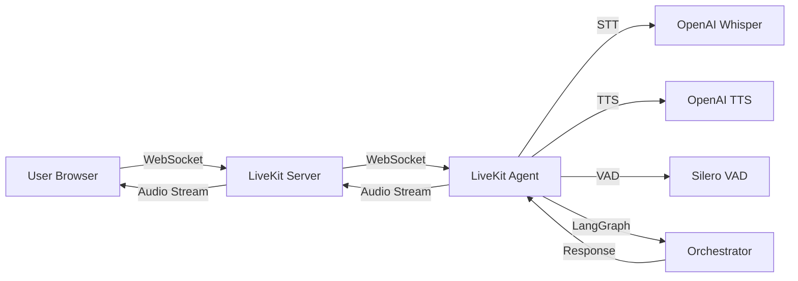
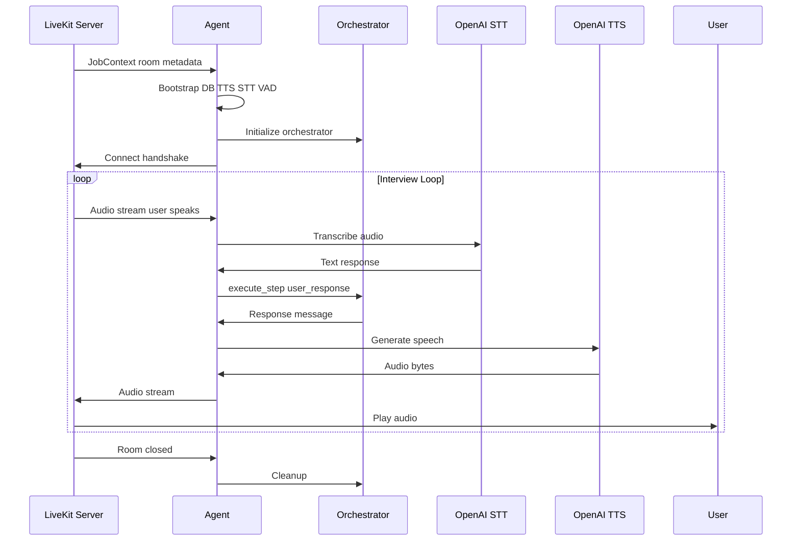

# Voice Infrastructure

## Architecture



The agent acts as a bridge between LiveKit's WebRTC streams and the orchestrator. Audio flows bidirectionally: user speech is buffered, VAD detects speech boundaries, then STT transcribes. The orchestrator processes text and returns `next_message`, which TTS converts to audio and streams back through LiveKit. The agent uses non-streaming STT (OpenAI's default), so VAD is required to detect when to send audio chunks for transcription.

## Components

| Component          | Technology                | Purpose                         | Latency   |
| ------------------ | ------------------------- | ------------------------------- | --------- |
| **LiveKit Server** | LiveKit Cloud/Self-hosted | WebRTC signaling, media routing | <100ms    |
| **Agent**          | LiveKit Agents Python SDK | Voice agent orchestration       | <50ms     |
| **STT**            | OpenAI Whisper API        | Speech-to-text                  | 200-500ms |
| **TTS**            | OpenAI TTS (tts-1-hd)     | Text-to-speech                  | 300-800ms |
| **VAD**            | Silero VAD                | Voice activity detection        | <50ms     |

## Agent Lifecycle



Bootstrap happens before connection to meet LiveKit's <100ms handshake requirement. Heavy imports (database, orchestrator) are deferred until after metadata extraction. The `OrchestratorLLM` adapter wraps the orchestrator, translating agent callbacks into `execute_step` calls with proper state loading and checkpointing. TTS/STT failures are handled gracefully—the agent continues with degraded functionality rather than crashing.

## Setup

### LiveKit Server

**Cloud (Recommended):**

- Sign up at [livekit.io](https://livekit.io)
- Get API key, secret, and URL
- Set environment variables:
  ```bash
  LIVEKIT_URL=wss://your-project.livekit.cloud
  LIVEKIT_API_KEY=your-api-key
  LIVEKIT_API_SECRET=your-api-secret
  ```

**Self-Hosted:**

```bash
docker run -d \
  -p 7880:7880 \
  -p 7881:7881 \
  -p 7882:7882/udp \
  -e LIVEKIT_KEYS="api-key: api-secret" \
  livekit/livekit-server
```

### Agent Configuration

```python
# src/core/config.py
LIVEKIT_URL = "wss://your-project.livekit.cloud"
LIVEKIT_API_KEY = "your-api-key"
LIVEKIT_API_SECRET = "your-api-secret"
OPENAI_API_KEY = "your-openai-key"
```

### Running Agent

```bash
# Development
python -m src.agents.interview_agent dev

# Production
python -m livekit.agents start src.agents.interview_agent
# Alternative (if PATH is set correctly): livekit-agents start src.agents.interview_agent
```

## Voice Pipeline

### Speech-to-Text (STT)

**Flow:**

1. User speaks → Browser captures audio
2. LiveKit routes audio to agent
3. Agent buffers audio chunks
4. VAD detects speech end
5. Agent sends to OpenAI Whisper
6. Text returned to orchestrator

**Configuration:**

```python
from livekit.plugins import openai

stt = openai.STT(
    model="whisper-1",
    language="en"  # Optional
)
```

### Text-to-Speech (TTS)

**Flow:**

1. Orchestrator generates response
2. Agent receives `next_message`
3. Text prepared for TTS (punctuation, pauses)
4. OpenAI TTS generates audio
5. Audio streamed to LiveKit
6. Browser plays audio

**Configuration:**

```python
from livekit.plugins import openai

tts = openai.TTS(
    voice="alloy",  # alloy, echo, fable, onyx, nova, shimmer
    model="tts-1-hd"  # tts-1 or tts-1-hd
)
```

**Voice Options:**
| Voice | Characteristics |
|-------|----------------|
| `alloy` | Neutral, professional (default) |
| `echo` | Warm, friendly |
| `fable` | Clear, articulate |
| `onyx` | Deep, authoritative |
| `nova` | Bright, energetic |
| `shimmer` | Soft, gentle |

### Voice Activity Detection (VAD)

**Purpose:** Detect when user stops speaking to trigger STT

**Implementation:**

- Silero VAD model (lightweight, fast)
- Loaded asynchronously to avoid blocking
- Graceful degradation if loading fails

```python
from livekit.plugins import silero

vad = await silero.VAD.load()  # Async loading
```

## Performance Optimization

### Latency Reduction

| Technique               | Impact | Implementation                     |
| ----------------------- | ------ | ---------------------------------- |
| **Streaming TTS**       | -200ms | Stream audio chunks as generated   |
| **VAD Optimization**    | -100ms | Lower threshold for speech end     |
| **Connection Pooling**  | -50ms  | Reuse OpenAI clients               |
| **Parallel Processing** | -150ms | STT + Intent detection in parallel |

### Resource Management

- **VAD Caching**: Per-process singleton (thread-safe)
- **Client Reuse**: OpenAI clients cached in NodeHandler
- **Connection Limits**: Max 50 concurrent interviews per agent instance

## Troubleshooting

| Issue               | Symptom                     | Solution                                            |
| ------------------- | --------------------------- | --------------------------------------------------- |
| **No audio**        | Agent connects but no sound | Check TTS API key, verify audio output enabled      |
| **STT not working** | User speech not transcribed | Verify VAD loaded, check STT API key                |
| **High latency**    | >1s delay                   | Check network, reduce TTS model (tts-1 vs tts-1-hd) |
| **Agent crashes**   | Connection drops            | Check memory usage, verify database connection      |

## Monitoring

**Key Metrics:**

- STT latency: <500ms (p95)
- TTS latency: <800ms (p95)
- End-to-end latency: <1.5s (p95)
- Agent uptime: >99.9%
- Concurrent interviews: Track active rooms
